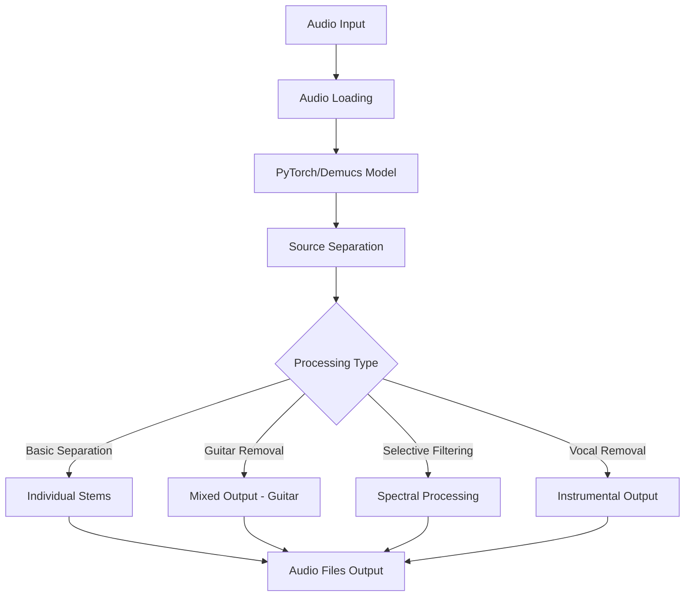

# SplitSonic - Audio Source Separation & Guitar Removal Tool

A comprehensive Python application for audio source separation and selective instrument removal using state-of-the-art deep learning models.

## 🏗️ Application Architecture

### Core Components

```
splitsonic/
├── modelsplitter.py    # Main module with advanced separation algorithms
├── guitar.py          # Simple CLI wrapper for basic operations
├── requirements.txt   # Python dependencies
└── README.md         # This documentation
```

### Architecture Overview



### Technology Stack

- **Deep Learning Framework**: PyTorch + TorchAudio
- **AI Model**: Demucs (Hybrid Transformers for Music Source Separation)
- **Audio Processing**: LibROSA, SciPy, SoundFile
- **Core Computing**: NumPy
- **Audio Format Support**: FFmpeg integration

## 🎵 Features

### Primary Functions

1. **`separate_stems()`** - Complete audio source separation
   - Separates audio into: drums, bass, vocals, other (guitars/keyboards)
   - Outputs individual stem files
   - Uses Demucs neural network model

2. **`remove_guitar()`** - Traditional guitar removal
   - Removes entire "other" stem containing guitars
   - Also removes keyboards and other non-drum/bass/vocal instruments
   - Fast but less selective

3. **`remove_guitar_keep_keyboards()`** - Advanced selective removal
   - Uses spectral filtering to target guitar frequencies
   - Preserves keyboards and other harmonic instruments
   - Configurable filter strength (0.0-1.0)

4. **`remove_vocals()`** - Vocal removal for instrumentals
   - Creates instrumental versions
   - Preserves all instruments including guitars

### Supported Audio Formats
- WAV, MP3, FLAC, M4A, and other FFmpeg-supported formats
- Stereo and mono input support
- Automatic format conversion


## 🚀 Usage

### Basic Usage

```python
from modelsplitter import separate_stems, remove_guitar, remove_vocals

# Separate audio into individual stems
stems = separate_stems("song.mp3", "./output_stems/")

# Remove guitar while keeping other instruments  
remove_guitar("song.mp3", "song_no_guitar.wav")

# Create instrumental version
remove_vocals("song.mp3", "song_instrumental.wav")

# Advanced: Remove guitar but keep keyboards
remove_guitar_keep_keyboards("song.mp3", "song_selective.wav", guitar_filter_strength=0.9)
```

### Command Line Usage

```bash
# Process single file with all operations
python modelsplitter.py input_song.mp3

# Simple separation using audio-separator wrapper
python guitar.py
```

## 📋 Installation

### Prerequisites
- Python 3.8+ (recommended: 3.11)
- CUDA-compatible GPU (optional, for faster processing)

### System Requirements
- **RAM**: 8GB minimum, 16GB recommended for large files
- **Storage**: 2GB for model files + space for output files
- **GPU**: Optional but significantly speeds up processing

## 🔧 Configuration

### Model Selection
Default: `htdemucs` (Hybrid Transformers Demucs)
- High quality separation
- Slower processing
- Alternative: `demucs` for faster processing

### Audio Processing Parameters
- **Sample Rate**: Automatically detected and preserved
- **Channels**: Stereo processing (mono files converted to stereo)
- **Bit Depth**: 32-bit float internal processing, configurable output

## 🐛 Troubleshooting

### Common Issues
1. **Out of Memory**: Reduce file size or use CPU processing
2. **Slow Processing**: Enable GPU acceleration or use lighter models
3. **Audio Quality**: Check input file quality and format

### Debug Mode
Enable verbose logging by setting environment variable:
```bash
export DEMUCS_VERBOSE=1
```

## 📈 Performance

### Typical Processing Times
- **3-minute song**: 30-60 seconds (GPU) / 2-5 minutes (CPU)
- **Full album**: 15-30 minutes (GPU) / 1-2 hours (CPU)

### Memory Usage
- **Typical**: 2-4GB RAM
- **Large files**: Up to 8GB RAM


## 🙏 Acknowledgments

- **Demucs**: Facebook Research team for the source separation model
- **PyTorch**: For the deep learning framework
- **LibROSA**: For audio processing utilities
